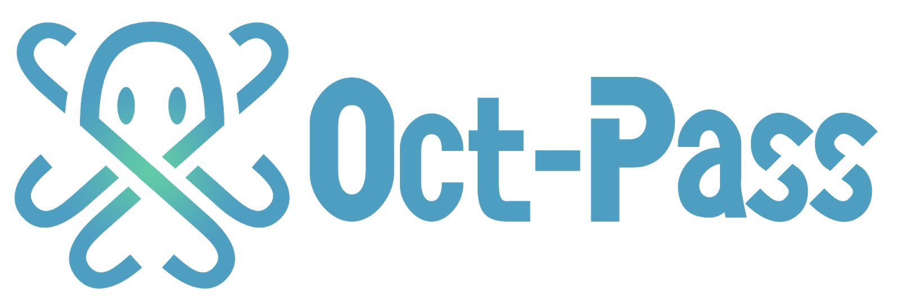

  

# Oct-Pass
「Oct-Pass」は誰でも無償で自由に利用することができるオープンなNFT共通仕様です。本仕様に準拠してNFTメタデータを作成することで、アプリケーション間におけるNFTの相互利用が容易にできるようになります。 これにより、ゲーム、SNS、マーケット、ウォレットなど異なるアプリケーションや、異なるブロックチェーンを跨いで、NFTで世界が繋がる「NFTメタバース」を実現する一助となることを目指しています。
詳細はこちらをご参照ください。

## Oct-Pass Improvement Proposal
Oct-Pass Improvemen Proposal(OIP)として改善案を受付、4段階にわけ更新を行います。
1. Idea
1.Abstract:概要、2.Motivation:なぜ必要なのか、3.Specification:詳細
上記フォーマットに従ってIssueをたて議論を行ってください。
その後、新規OIPフォーマットに沿ってPull Requestを出してください。
2. Draft
当協会内で協議の上、ドラフトとして採用(Pull requestがmerge)されます。
3. Review
14日間レビュー期間を設けてパブリックコメント募集を行います。
4. Final
レビュー期間に集まった意見を反映したり、問題なければそのまま最終化(実装)されます。

## Project Goal
Oct-Pass Improvement Proposalリポジトリは、Oct-passに関する具体的な提案を共有する場所として存在します。

## Question Guide
ヘルプとサポートについては、[ブロックチェーンコンテンツ協会](https://www.blockchaincontents.org/contact)へご連絡ください。
